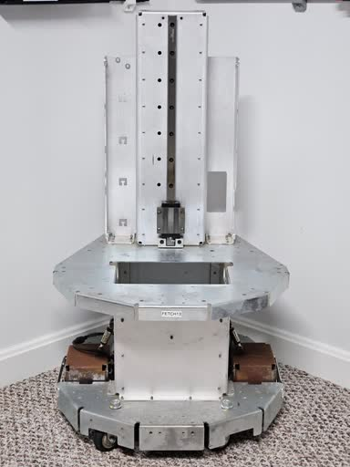

#  carrie
Building a mobile manipulator based on a [Fetch Mobile Manipulator](https://github.com/ZebraDevs/fetch_ros) chassis.
<p align="center">
  
</p>

# tl;dr
Build a new development image

> [!Note]
> The `REPO` variable is defined in `.env`

```
source .env
mkdir -p ~/.${REPO}/ccache
export UID=$(id -u) GID=$(id -g); docker compose -f compose.dev.yml build
```
Start an interactive development container
```
docker compose -f compose.dev.yml run --rm development
```
Build the repository in the container
```
colcon build
```

# test
To test that your container is working with graphics
```shell
colcon build
source install/setup.bash
ros2 launch carrie_description view_carrie.launch.py
```

# orphans
```shell
docker compose -f compose.dev.yml down --remove-orphans
```
